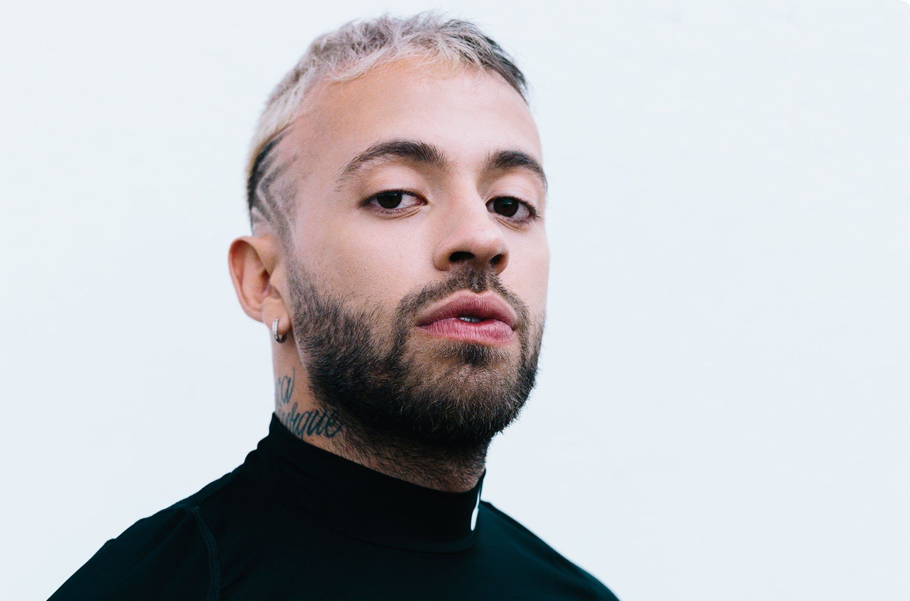
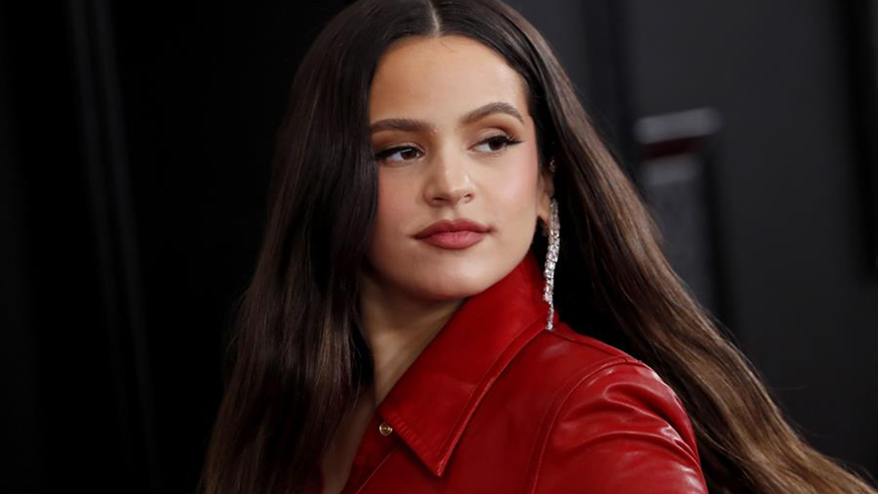

<HTML>
	<HEAD>
		<meta charset="utf-8">
		<TITLE>Para Ti <3</TITLE>
		</HEAD>
	<BODY BGCOLOR="#00008B">
	<bgsound src="Alemán - Down With Me feat. Emy Soul.mp3" loop="10"></bgsound>

		<TABLE BGCOLOR="#6A5ACD" frame="vsides">

			<CAPTION ALIGN="TOP"> <b> MI MÚSICA, CANTANTES Y ARTISTAS   FAVORITOS </CAPTION> </b>

			<tr align="center"> <td> <a target="_blank" href="https://www.youtube.com/watch?v=lK3vClOwiEs&list=PL0HwpwsUFIQw0hSq51njqS6_WRG7Zj0nD">Música1</a></td> <td><a target="_blank" href="https://www.youtube.com/watch?v=utQI45s4yMs">Video1</a></td> <td><a target="_blank" href="https://www.youtube.com/watch?v=dfLNa--tRy0">Video2</a></td> <td><a target="_blank" href="https://www.youtube.com/watch?v=6N4mxe8Druw">Radio1</a></td> <td><a target="_blank" href="https://www.youtube.com/watch?v=illasjYc1KQ&list=PLk9eIWYJgf_Pq04YdQNQHgPNH7gM-jwIe&index=17">Radio2</a></td> </tr>

			<tr> <th BGCOLOR="white" Colspan="2">  <b> Cantantes Famosos </b> </th>
			<td width="8%"></td>
			<th BGCOLOR="white">  <b> Noticias </b> </th> <th BGCOLOR="white">  <b> Peliculas </b> </th></tr>

			<td align="center"><a href="https://www.youtube.com/watch?v=Hp__tcvnEnk" target="blank"> </td>
			<td width="43%g"> Salomon Villada Hoyos (Medellín, Colombia 19 de Agosto de 1992) más conocido por su nombre artístico como Feid es un cantante y compositor colombiano. Nació en Medellín Colombia,y durante su carrera ha trabajado con varios artistas reconocidos como J Balvin, Lenny Tavárez, Mario Hart, Sebastián Yatra, Nacho, entre otros. Sus exitos musicales constan de temas como lo son: badwine (Extended Remix), Ron (Remix), FRESH KERIAS, Ateo, BORRAXXA y Porfa.  </td>
			</tr>

			<td align="center"><a href="https://www.youtube.com/watch?v=ublf6qfpuuo" target="blank"> </td>
			<td width="43%"> Benito Antonio Martínez Ocasio (Vega Baja, San Juan, Puerto Rico; 10 de marzo de 1994), más conocido por su nombre artístico Bad Bunny, es un cantante, rapero y trapero puertorriqueño de género reguetón y trap latino. Conocido por sus temas «Soy peor», «Chambea», «Amorfoda», «Callaíta» y más recientemente «A Tu Merced». El artista cuenta con cuatro discos y uno en colaboración con J Balvin.  </td>
			</tr>

			<td align="center"><a href="https://www.youtube.com/watch?v=2j3x0VYnehg" target="blank"> </td>
			<td width="43%"> Rosalía Vila Tobella (San Esteban de Sasroviras, Barcelona; 25 de septiembre de 1993), conocida simplemente como Rosalía, es una cantante, actriz, compositora y productora española. Ha sido galardonada con dos Premios Grammy Latinos por «Malamente» y cinco por su segundo álbum El mal querer, que la convirtieron en la artista española con más galardones otorgados por la Academia Latina de Artes y Ciencias de la Grabación por un único trabajo, y dos MTV Video Music Awards. El 26 de enero de 2020 recibió el Premio Grammy a mejor álbum latino de rock, urbano o alternativo en la ciudad de Los Ángeles, siendo además la primera persona de la historia, en estar nominada al Grammy de Mejor Nuevo Artista con un álbum debut en español.</td>
			</td> </tr>

			<td align="center"><a href="https://www.youtube.com/watch?v=xNdQ0Iw34wU" target="blank"> </td>
			<td width="43%"> Pedro David Daleccio Torres (Filadelfia, Estados Unidos, 7 de octubre de 1990), más conocido por su nombre artístico Dalex, es un músico y cantante estadounidense. Anteriormente formó parte del dúo Jayma y Dalex, pero que en el año 2017, decidió abandonar la dúo con el fin de convertirse en solista.En el 2019, estrena su álbum debut como solista titulado "Climaxxx" y es nominado a Los Premios Juventud en la categoría de nueva generación urbana; en ese mismo año participó en un álbum musical en equipo junto con Feid, Sech, Lenny, J Quiles y Dimelo Flow; titulado "The Academy (Los Avengers)", también colaboró en el álbum de Miky Woodz titulado "El OG Week". Para el 2020, Dalex lanza el primer sencillo "Mejor" junto a Sech, primera canción de su nuevo EP "Modo de Avión", el cual fue estrenado el 19 de marzo de 2020, con un total de 9 canciones con colaboraciones de Justin Quiles, Farruko, Lenny Tavarez, Sech, Jay Wheeler, entre otros.</td>
			

		</TABLE>
	</BODY>
</HTML>
